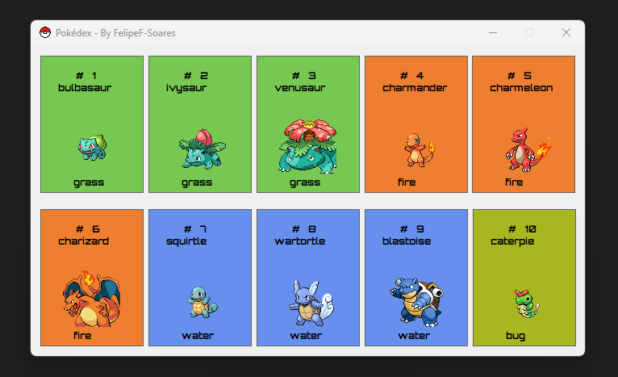

# Bem-vindo à "Pokédex.NET"
{:height="30px" width="30px"}
## Descrição
Nossa Pokédex.NET faz tem como finalidade fazer uma requisição HTTP Get, trazendo uma lista dinâmica de Pokémon diretamente para o WindowsForm. Você pode conferir os IDs, nomes, imagens e poderes dos Pokémon.
  
## Motivação
Enquanto alguns podem dizer que já estamos um pouco "maduros" para perseguir Pikachu e Charmander por aí, a verdade é que nunca é tarde para aprimorar nossas habilidades, seja na captura de Pokémon ou no desenvolvimento de software. Então, posso estar até um pouco "velho" para se aventurar no mundo Pokémon, mas na verdade, estou apenas treinando para se tornar um Mestre C# com uma pitada de humor e alegria. É tudo sobre capturar as melhores práticas de programação e evoluir para o próximo nível.
## Funcionalidades 
Em Desenvolvimento.
 ## Como Instalar e Executar 
 Basta Fazer o clone da aplicaçao ou baixar o zip
 dentro da pasta Pokedex\bin\Release\net6.0-windows existe um .exe clique duas vezes para testar.